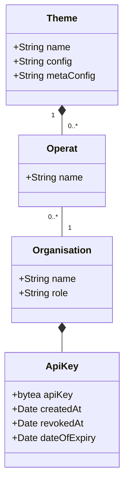

# p-agi_datahub

## Datenmodell


## Usecases

### Neuer API-Key generieren

Die Organisation "ebag" will einen neuen/zusätzlichen API-Key generieren.

Request:

```
curl -i -X POST --header "X-API-KEY: 79851F35-2871-4FC6-B90F-5C54F1EE1C81" -F 'organisation=ebag' /api/token'
```

Antwort (Body): 

```
{
    "organisation": "ebag",
    "key": "C6215952-C7E3-4FAB-85FC-6BB5F2432F7D"
}
```

Statuscodes:

- 200, falls neuer Key erzeugt wurde.
- 401, falls gültiger Key nicht existiert oder vorhanden aber nicht zu Organisation passt.

Bemerkungen:

- Neuer API-Key generieren bedingt authentifizierter Benutzer.
- Erster Key wird durch Administrator erstellt. Administrator-Account muss beim Hochfahren der Anwendung erstellt werden (Lösung für "Huhn-/Ei-Problem").
- API-Key wird nur ein einziges Mal für den Menschen lesbar dargestellt: in der Antwort. In der DB gehashed gespeichert. Es müssen keine E-Mails mit API-Key verschickt werden.
- Alternative mit ` -d '{"organisation":"ebag"}`, ohne form parameter
- Key zu Organisation mit Admin-Rolle darf alles.

### API-Key löschen (ungültig machen)

Request:

```
curl -i -X DELETE --header "X-API-KEY: C6215952-C7E3-4FAB-85FC-6BB5F2432F7D" -F 'key=79851F35-2871-4FC6-B90F-5C54F1EE1C81' /api/token
```

Antwort (Body): 

```
{
    "message": "Key deleted."
}
```

Statuscodes:

- 200, falls Key revoked/gelöscht wurde.
- 500, falls Fehler.

Bemerkungen:

- API-Key wird nicht aus DB gelöscht, sondern das `revokedAt`-Datum wird gesetzt.
- Key zu Organisation mit Admin-Rolle darf alles.

### Daten senden

Request:

```
curl -i -X POST  --header "X-API-KEY: C6215952-C7E3-4FAB-85FC-6BB5F2432F7D" -F 'file=@lala.xtf' -F 'thema=foo' -F 'operat=bar' /api/deliveries
```

Antwort bei Erfolg (Header): 

```
HTTP/1.1 202
Operation-Location: http://localhost:8080/api/jobs/<jobId>
Content-Length: 0
Date: Sat, 37 May 2023 16:40:50 GMT
```

Bemerkungen:
- Es wird ein Job erstellt (202=created). Mit `/api/jobs/<jobId>` kann man sich über den Stand informieren. M2M wie auch mit HTML.
- Key zu Organisation mit Admin-Rolle darf alles.

- Authentifizierung:
  * Gibt es Key in Datenbank?
  * Fail -> 401

- Authorisierung:
  * Folgt auf Authentifizierung, ergo ist Key sicher vorhanden.
  * Mit API-Key wird in der DB geprüft, ob die dem Key zugeordneter Organisation berechtigt ist, das "operat=bar" (siehe oben) zu liefern.
  * Fail -> 403